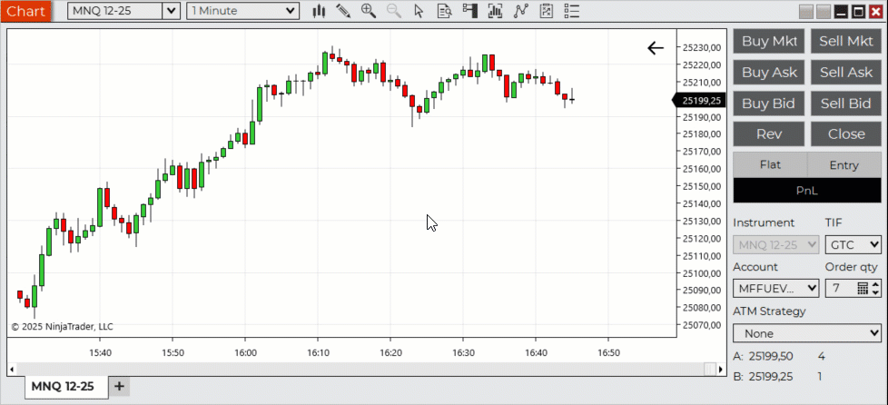

# NinjaTrader FixRisk

A simple **NinjaTrader 8 indicator** for quick and precise **position sizing** based on your desired risk per trade and stop distance. Built for professional discretionary futures and forex traders who prefer clear, rule-based risk management. Ideal for fast scalping as well as any kind of position sizing based on market entries.

## ⚙️ Features

- Calculates optimal position size based on:
  - Fixed risk amount (in account currency)
  - Stop-loss distance (defined by chart line)
  - Instrument tick value
- Automatically fills the **Chart Trader → QTY** field
- Displays position size and risk information directly on the chart
- Automatically references the Ask price for long trades (stop below market) and the Bid price for short trades (stop above market)
- Lightweight, zero-dependency, and open-source

## 📦 Installation

1. Download `FixRisk.cs`
2. In NinjaTrader:
   - Go to **New → NinjaScript Editor**
   - Right-click the **Indicators** folder → **New Indicator**
3. Press **Generate**
4. Remove all default code
5. Paste the contents of `FixRisk.cs`
6. Press the **Compile** button  at the top of the NinjaScript Editor window
7. After compilation, add *FixRisk* to your chart

## 🧠 Usage

The **red line** represents your *imaginary stop-loss* for the calculation. 
If you place a market order and set your actual stop exactly at that line, a stop-out will result in a loss equal to the **risk amount** you specified in the indicator settings.

1. Set your desired **risk per trade** (in account currency)
2. Position the **red line** where your stop-loss would be
3. The indicator automatically:
   - Calculates and displays the optimal position size on the chart
   - Updates the Chart Trader’s **QTY** field accordingly

## 🧾 License

This project is licensed under the [MIT License](./LICENSE).

## 👤 Author

**Norbert Szabo**  
CTO, developer, and part-time trader
